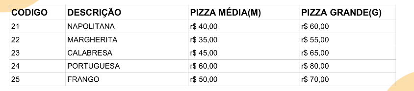

# Desafio

Você e sua equipe de programadores foram contratados para desenvolver um app de vendas para
uma pizzaria. Você ficou com a parte de desenvolver a interface do cliente para retirada do produto.

A Pizzaria possui seguinte tabela de sabores de pizzas listados com sua descrição, códigos e valores:

Elabore um programa em Python que:

- Informe a quantidade de pizzas;
- Informe o tamanho e o código de cada Pizza;
- Informe se entrega ou balcão, se for entrega será cobrado R$ 10,00 de taxa no
balcão não tem taxa;
- Informe o total a pagar.

## Como Rodar?

Basta rodar o arquivo main.py com um interpretador Python